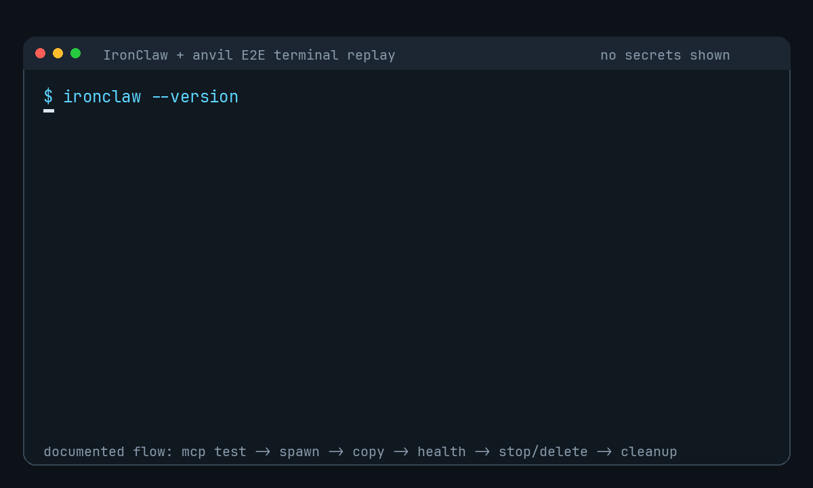

# anvil

[](https://github.com/HardcoreMonk/anvil/actions/workflows/ci.yml)
[](https://github.com/HardcoreMonk/anvil/tags)
[](https://go.dev/)
[](LICENSE)
[](https://github.com/firecracker-microvm/firecracker)

**IronClaw의 tool call을 격리 MicroVM 실행으로 변환하는 AI agent execution layer**

`anvil`은 IronClaw의 판단과 tool call을 Firecracker MicroVM 안의 실제 agent
실행으로 변환하는 격리 execution layer다.

IronClaw는 상위 orchestration, planner, MCP client 역할을 맡는다. anvil은 그
요청을 VM 생성, 작업 실행, health 확인, graceful stop/delete, snapshot/restore
같은 실행 lifecycle로 바꾼다.

구조적으로 anvil은 두 경계를 연결한다. 첫 번째는 IronClaw가 호출하는
`anvil_*` MCP tool surface이고, 두 번째는 ephemera가 제공하는 KVM 기반
Firecracker MicroVM runtime boundary다.

즉 anvil은 IronClaw가 직접 host runtime 세부사항을 알지 않아도, 격리된 agent
workspace를 생성하고 제어할 수 있게 만드는 MCP adapter이자 실행 계약이다.

IronClaw와 ephemera를 서비스 대 서비스로 1:1 직접 연결하지 않는 이유는 두
시스템의 책임과 추상화 수준이 다르기 때문이다.

IronClaw는 "어떤 agent 작업을 수행할 것인가"를 결정하는 orchestration/MCP client
계층이다. ephemera는 "어떤 VM을 만들고 어떤 host resource를 정리할 것인가"를
다루는 low-level runtime control plane이다.

직접 연결하면 IronClaw가 VM ID, guest private URL, daemon token, agent token,
snapshot file lifecycle, cleanup 실패 처리 같은 runtime 세부사항을 알아야 한다.

anvil은 이 결합을 막는다. IronClaw에는 안전한 `anvil_*` tool 계약만 노출하고,
내부에서 ephemera API 호출, session alias, token redaction, workspace 정책,
restore/cleanup 의미를 변환한다.

anvil의 상위 통합 대상은 IronClaw 전용이다. OpenClaw 연동은 anvil의 지원 범위가
아니며, OpenClaw용 compatibility layer나 운영 계약은 제공하지 않는다.

이 저장소의 현재 URL은 `https://github.com/HardcoreMonk/anvil/`이다.
이 저장소는 `https://github.com/steve-seungeui/ephemera`의 fork로 유지한다.
ephemera는 계속 버전업되는 runtime engine upstream이고, anvil은 그 runtime을
IronClaw 실행 계층으로 통합하는 downstream product fork다. 따라서 Go 모듈 경로,
daemon 이름, HTTP API, 일부 환경 변수에는 `ephemera` 또는 `goose` 이름이 남아
있다. README에서는 `anvil`을 IronClaw 통합 프로젝트로, `ephemera`를 분리된 기반
runtime으로 구분한다.

버전별 ephemera 소스 snapshot은 Git tag로 공개된다. 현재 ephemera runtime 공개
tag 기준은 `v0.3.0`이고, IronClaw 통합 프로젝트 anvil의 첫 공개 tag는
`anvil-v0.1.0`이다.

<p align="center">
  
</p>

<p align="center">
  <sub>IronClaw 본체에서 anvil MCP tool을 호출한 E2E terminal replay</sub>
</p>

---

## 프로젝트 경계

- **IronClaw**: 상위 orchestration, MCP client, 작업 의사결정을 담당한다.
  현재 구현은 anvil 밖의 외부 통합 계층이다.

- **anvil**: IronClaw가 사용할 MCP tool surface와 실행 lifecycle 계약을 제공한다.
  구현 위치는 `cmd/anvil-mcp`, `internal/anvilmcp`다.

- **anvil runtime scheduler**: 여러 ephemera daemon host 후보 중 요청을 실행할
  host를 고르고 placement/snapshot locality/quota 상태를 보존한다. 구현 위치는
  `cmd/anvil-scheduler`, `internal/anvilmcp`다.

- **ephemera**: Firecracker MicroVM 생성, agent proxy, snapshot/restore,
  host resource 정리를 담당한다. 구현 위치는 `cmd/goose-daemon`, `internal/vm`,
  `internal/storage`, `internal/network`다.

- **guest runtime**: VM 내부 task 실행, health, graceful stop을 담당한다.
  구현 위치는 `cmd/goose-agent`, `cmd/micro-init`이다.

anvil은 ephemera를 이름만 바꾼 프로젝트가 아니다. anvil은 IronClaw와 ephemera를
연결하는 통합 실행 layer이고, ephemera는 독립적인 runtime 구현과 API 계약을
가진다. 따라서 runtime API와 환경 변수는 호환성을 위해 ephemera/goose 이름을
유지하고, IronClaw가 직접 사용하는 표면은 `anvil_*` MCP tool로 노출한다.

## Fork와 upstream 관리

`HardcoreMonk/anvil`은 `steve-seungeui/ephemera`의 fork network를 유지한다. 이
관계는 의도된 운영 방식이다. ephemera가 runtime engine으로 계속 버전업되기 때문에
anvil은 upstream runtime 변경을 merge로 받아들이고, IronClaw 통합 계층을 그 위에
적응시킨다.

권장 remote 설정:

```bash
git remote -v
git remote add upstream https://github.com/steve-seungeui/ephemera.git
git remote set-url upstream https://github.com/steve-seungeui/ephemera.git
git remote set-url --push upstream DISABLED
```

upstream sync는 별도 branch에서 수행한다.

```bash
git fetch upstream main
git ls-remote --tags upstream
git checkout -b sync/ephemera-v0.3.0 origin/main
git merge --no-ff upstream/main
```

기존 `v*` tag를 덮어쓰는 `git fetch --tags --force`는 사용하지 않는다. ephemera
runtime release tag는 `v*`, anvil product release tag는 `anvil-v*` prefix를
사용한다. anvil 작업 branch는 rebase/history rewrite 없이 PR merge로 관리한다.

## anvil 실행 모델

```text
IronClaw
  - planner / orchestrator
  - MCP client
      |
      | stdio MCP tool call
      v
anvil MCP adapter
  - anvil_spawn_vm
  - anvil_run_task
  - anvil_create_snapshot
  - anvil_restore_snapshot
      |
      | optional scheduler-backed host selection
      v
anvil runtime scheduler
  - host inventory
  - quota and placement state
  - snapshot locality
      |
      | HTTP + optional Bearer token
      v
ephemera runtime boundary
  - control plane :3000
  - Firecracker MicroVM
  - goose-agent task runtime
```

IronClaw 관점에서 anvil은 다음 계약을 제공한다.

- VM 생성과 local `session_name` alias binding
- VM 내부 prompt/task 실행
- VM health, graceful stop, delete lifecycle
- full/diff snapshot 생성, 목록, restore, 삭제
- daemon token과 guest agent token을 분리하는 proxy 보안 경계
- restore 후 alias bind race를 명시적으로 노출하는 cleanup 계약

## anvil 핵심 기능

- **IronClaw MCP adapter**:
  `cmd/anvil-mcp`가 IronClaw에 `anvil_*` MCP tool을 제공한다.

- **VM lifecycle tool**:
  `anvil_spawn_vm`, `anvil_run_task`, `anvil_get_vm_health`,
  `anvil_stop_vm`, `anvil_delete_vm`을 제공한다.

- **Snapshot lifecycle tool**:
  `anvil_create_snapshot`, `anvil_list_snapshots`, `anvil_restore_snapshot`,
  `anvil_delete_snapshot`을 제공한다.

- **Session alias**:
  adapter process 내부에서 `session_name -> vm_id` alias를 유지해
  IronClaw workflow를 단순화한다.

- **Token redaction**:
  `agent_token`은 `POST /vms` 응답에만 노출하며 daemon restore 응답과 MCP output에는
  노출하지 않는다.

- **Restore cleanup 계약**:
  restore 성공 후 alias bind가 실패하면 restored VM을 자동 삭제하지 않고
  error에 VM ID를 포함한다.

---

## ephemera runtime 분리

ephemera는 anvil이 사용하는 기반 실행 엔진이다. VM 생성, Firecracker machine
관리, TAP/IP 할당, rootfs 준비, snapshot file 관리, guest agent proxy, multi-agent
flock과 Town Wall log는 ephemera control plane이 소유한다. anvil MCP adapter는
이 의미를 재해석하지 않고 얇게 호출한다.

ephemera runtime의 현재 HTTP API 구조:

```text
외부 client 또는 anvil MCP adapter
      |
      | HTTPS, TLS 종료는 reverse proxy가 담당
      v
Reverse proxy :443
      |
      | HTTP + control-plane Bearer token
      v
ephemera control plane :3000
  GET    /health               -> daemon 상태
  GET    /metrics              -> Prometheus text metrics
  GET    /metrics/vms          -> 실행 중인 VM별 JSON metrics
  GET    /tenants              -> tenant quota/usage 목록
  GET    /tenants/{tenant_id}  -> tenant quota/usage 조회
  PUT    /tenants/{tenant_id}  -> tenant quota 설정
  GET    /audit/runtime        -> runtime audit 조회
  POST   /audit/runtime/prune  -> runtime audit 보관 정책 적용
  POST   /vms                  -> VM 생성
  GET    /vms                  -> 실행 중인 VM 목록
  DELETE /vms/{vm_id}          -> VM 종료 및 리소스 정리
  POST   /vms/{vm_id}/snapshot -> VM snapshot 생성
  GET    /snapshots            -> snapshot 목록
  POST   /snapshots/gc         -> snapshot GC dry-run/apply
  POST   /snapshots/{id}/restore
                                -> snapshot에서 VM 복원
  DELETE /snapshots/{id}       -> snapshot 삭제
  POST   /flocks               -> 역할별 VM flock 생성
  GET    /flocks               -> flock 목록
  GET    /flocks/{id}          -> flock과 agent 상태 조회
  DELETE /flocks/{id}          -> flock 소속 VM 병렬 삭제
  POST   /flocks/{id}/post     -> Town Wall message append
  GET    /flocks/{id}/wall     -> Town Wall SSE stream
  GET    /flocks/{id}/wall/history
                                -> Town Wall 전체 history 조회

      |
      | Firecracker SDK, KVM, TAP, rootfs, snapshot files
      v
Firecracker MicroVM, ephemera runtime
  - Debian Trixie minbase rootfs
  - micro-init, PID 1
  - goose-agent :8080
  - goose CLI task 실행

외부 client
      |
      | control plane proxy
      v
POST /vms/{vm_id}/tasks  -> goose-agent :8080/tasks
GET  /vms/{vm_id}/workspace?path=...
PUT  /vms/{vm_id}/workspace?path=...
                         -> goose-agent :8080/workspace
GET  /vms/{vm_id}/health -> goose-agent :8080/health
POST /vms/{vm_id}/stop   -> goose-agent :8080/stop
```

`EPHEMERA_PUBLIC_URL`이 설정되어 있으면 ephemera `POST /vms` 응답의 `agent_url`은
control plane proxy 경로를 가리킨다. 설정되지 않은 경우 host에서 접근 가능한
VM private IP가 반환된다.

### VM 생성 흐름

```text
CloneDisk() 또는 CloneDiskCOW()
  -> 기본값은 golden image를 VM별 ext4 disk로 copy
  -> EPHEMERA_DISK_MODE=cow이면 dm-snapshot 기반 sparse COW disk 사용

PrepareVM()
  -> goose.yaml, goose-secrets.yaml, agent_token, /etc/localtime 주입
  -> flock member이면 /root/.ephemera-flock, /root/.goose-system-prompt 주입
  -> 단일 mount/unmount cycle 사용

StartMachine()
  -> Firecracker kernel + disk + TAP NIC 시작
  -> DHCP 없이 kernel ip= boot parameter로 네트워크 설정

waitForAgent()
  -> http://10.0.1.x:8080/health readiness poll
  -> cold boot 기준 약 60초
```

### Snapshot/Restore 흐름

```text
POST /vms/{id}/snapshot
  -> snapshot type 자동 선택
     - 해당 VM의 기존 Full 없음: Full
     - 기존 Full 있음: Diff
  -> PauseVM()
  -> CreateSnapshot(memory.bin, state.bin)
  -> rootfs.ext4 copy
  -> ResumeVM() 또는 stop_after=true이면 source VM 삭제

POST /snapshots/{id}/restore
  -> Diff이면 base memory + diff memory merge
  -> SetupDMSnapshot()으로 COW rootfs 구성
  -> original TAP name/MAC 재생성, 새 IP 할당
  -> Firecracker RestoreMachine()
  -> vsock CHANGE_IP로 guest IP 재설정
  -> /health readiness poll
```

Firecracker snapshot state에는 TAP device name과 disk path가 들어 있다.
ephemera는 restore 시 해당 device identity를 재생성하고, IP는 vsock channel을
통해 새 값으로 재설정한다.

### 종료 흐름

```text
DELETE /vms/{id}
  -> StopVMM()
  -> micro-init이 SIGTERM 수신
  -> goose-agent 종료 요청
  -> sync + poweroff(2)
  -> COW restore VM이면 dm-snapshot/loop/bind mount/.cow 정리
  -> 일반 VM이면 cloned ext4 disk 삭제
  -> TAP/IP 반환
```

---

## ephemera runtime 기능

- **자체 bootstrap**:
  ephemera 첫 실행 시 golden image, kernel, Firecracker binary를 준비하고 검증한다.

- **최소 guest OS**:
  Debian Trixie minbase와 Go 기반 `micro-init`으로 구성한다.

- **안전한 guest 종료**:
  `micro-init`이 signal을 받아 `poweroff(2)`를 호출해 kernel panic을 피한다.

- **VM별 LLM profile**:
  VM 생성 시 `configs/profiles/{name}/`의 provider/model/secret을 선택할 수 있다.

- **런타임 설정 주입**:
  `goose.yaml`, `goose-secrets.yaml`을 provision time에 주입한다.

- **VM별 agent 인증**:
  VM마다 별도 Bearer token을 생성하고 guest disk에 `0600`으로 저장한다.

- **Full/Diff snapshot**:
  첫 snapshot은 Full, 이후 snapshot은 dirty memory page 기반 Diff로 자동 선택된다.

- **COW rootfs restore**:
  restore VM은 snapshot rootfs를 read-only base로 공유하고 sparse COW file에
  쓰기를 기록한다.

- **Restore 후 IP 재설정**:
  VM은 새 IP를 할당받고 vsock으로 guest network stack을 갱신한다.

- **IP/TAP 재사용**:
  lifecycle 종료 후 `10.0.1.2-254` IP와 TAP ID를 pool에 반환한다.

- **Outbound NAT**:
  `goose-br0`와 iptables MASQUERADE로 guest의 LLM API outbound를 지원한다.

- **Control-plane 인증**:
  named Bearer token, timing-safe compare, audit log, `SIGHUP` hot reload를 지원한다.

- **Multi-agent flock**:
  `POST /flocks`가 역할별 VM 여러 개를 생성하고 하나의 flock ID 아래에서
  관리한다. 생성 중 일부 VM이 실패하면 이미 생성된 VM과 flock registry를 정리한다.

- **Town Wall**:
  flock별 append-only coordination log를 제공한다. control plane API,
  SSE stream, VM 내부 `gtwall` CLI로 같은 log에 message를 남길 수 있다.

- **역할별 resource profile**:
  `researcher`, `reviewer`, `worker`, `orchestrator`, `builder` 역할은
  `LookupProfile`을 통해 vCPU/memory와 profile directory를 결정한다.

- **역할 system prompt 주입**:
  `configs/profiles/{role}/system.md`를 VM 내부 `/root/.goose-system-prompt`로
  주입하고, `goose-agent`가 task prompt 앞에 system instruction으로 붙인다.

- **선택적 COW spawn disk**:
  `EPHEMERA_DISK_MODE=cow`이면 새 VM 생성도 dm-snapshot 기반 sparse COW disk를
  사용한다. unset 상태에서는 기존 full clone 동작을 유지한다.

---

## 프로젝트 구조

```text
cmd/
  goose-daemon/       ephemera control plane daemon
    main.go           startup, artifact bootstrap, ControlPlane init
    api.go            VM/snapshot API, auth middleware, proxy
    config.go         환경 변수 기반 설정
    orchestrator_api.go
                      flock/Town Wall control-plane API
  anvil-mcp/          anvil/IronClaw용 stdio MCP adapter entrypoint
  anvil-scheduler/    runtime host/quota/placement scheduler service
  goose-agent/        VM 내부 HTTP agent
  micro-init/         VM 내부 PID 1

internal/
  anvilmcp/           MCP config, daemon client, session alias, scheduler/router,
                      quota, placement, runtime audit helper
  orchestrator/       flock registry, agent 상태, Town Wall append-only log
  vm/machine.go       Firecracker SDK wrapper
  network/manager.go  IP pool, TAP lifecycle, bridge, NAT
  storage/
    provisioner.go    golden image bootstrap, disk clone, config/token injection
    snapshot.go       snapshot metadata, COW restore, diff memory merge

configs/
  anvil-mcp.yaml.example
  goose.yaml.example
  goose-secrets.yaml.example
  profiles/<profile-name>/
    goose.yaml.example
    goose-secrets.yaml.example
    system.md

docs/
  architecture/        ephemera 런타임, 서비스 로직, anvil MCP 아키텍처
  analysis/            ephemera 버전 비교와 소스 분석
  lifecycle/runs/      계산된 lifecycle 상태 snapshot
  operations/          보안 정책, runbook, DR, 관측성, release/operate 기록
  superpowers/         승인된 spec, review, plan 기록

snapshots/             snapshot 저장 디렉터리, gitignore
artifacts/             runtime artifact 디렉터리, gitignore
e2e_test.sh            58단계 통합 테스트
scripts/build_image.sh golden image build script
scripts/anvil-mcp-e2e.sh daemon 기반 MCP smoke wrapper
scripts/gtwall         VM 내부 Town Wall post helper
```

## 문서 지도

- [CONTEXT.md](CONTEXT.md):
  anvil/ephemera/IronClaw 경계, 진실 기준 문서 순서, 고정 계약.

- [AGENTS.md](AGENTS.md):
  Codex 작업 규약, 검증 명령, 불변 조건.

- [RELEASE_NOTES.md](RELEASE_NOTES.md):
  Unreleased runtime scheduler/network/observability 변경과 ephemera `v0.1.0`,
  `v0.2.0`, `v0.3.0`, anvil `anvil-v0.1.0` 변경 사항.

- [docs/architecture/runtime-architecture.md](docs/architecture/runtime-architecture.md):
  ephemera daemon, MicroVM, storage, network, guest runtime 구조.

- [docs/architecture/service-logic.md](docs/architecture/service-logic.md):
  ephemera control-plane API, VM lifecycle, snapshot/restore, guest agent 흐름.

- [docs/architecture/mcp-architecture.md](docs/architecture/mcp-architecture.md):
  IronClaw MCP adapter 구조와 tool 계약.

- [docs/architecture/multi-tenant-roadmap.md](docs/architecture/multi-tenant-roadmap.md):
  tenant quota, scheduler, egress policy, audit storage, multi-host runtime의
  책임 경계와 단계적 확장 기준.

- [docs/operations/security-policy.md](docs/operations/security-policy.md):
  공개 노출, 제어 평면 token, guest agent token, snapshot metadata 반출 보안 정책.

- [docs/operations/runbook.md](docs/operations/runbook.md):
  daemon 빌드/시작, health 확인, VM 정리, snapshot GC dry-run/apply 운영 명령.

- [docs/operations/disaster-recovery.md](docs/operations/disaster-recovery.md):
  daemon crash, stale TAP/IP, restore 실패, GC 실패, diff base 누락 대응 playbook.

- [docs/operations/observability.md](docs/operations/observability.md):
  daemon log, `/health`, `/metrics`, `/metrics/vms`, snapshot GC audit, runtime audit
  API, optional trace export, 향후 지표 후보.

- [docs/analysis/README.md](docs/analysis/README.md):
  ephemera 0.1.0/0.2.0 분석 문서 index.

- [anvil redesign handoff](docs/operations/2026-05-11-anvil-redesign-handoff.md):
  재설계 release/operate handoff 근거.

- [anvil release checklist](docs/operations/release-checklist.md):
  ephemera runtime 릴리즈와 anvil integration 릴리즈를 구분하는 게시 전
  확인 절차와 `anvil-v0.1.0` GitHub Release 본문 초안.

- [upstream sync policy](docs/operations/upstream-sync-policy.md):
  `steve-seungeui/ephemera` fork 유지, upstream merge, tag 충돌 방지, sync PR 운영
  기준.

---

## 사전 요구사항

| 항목 | 내용 |
|---|---|
| Host OS | Ubuntu 22.04 또는 24.04 권장 |
| CPU | `/dev/kvm` 접근 가능 |
| Go | 1.25 이상 |
| Package | `curl`, `debootstrap`, `e2fsprogs`, `util-linux` |
| 권한 | 실행 시 `sudo` 필요. KVM, bridge, TAP, iptables를 설정한다. |

```bash
sudo apt-get install -y curl debootstrap e2fsprogs util-linux
```

Firecracker, Linux kernel, golden image는 첫 실행 시 자동으로 다운로드하거나
빌드한다.

---

## 시작하기

### 1. 복제와 빌드

```bash
git clone https://github.com/HardcoreMonk/anvil.git
cd anvil
go build -o anvil-daemon ./cmd/goose-daemon/
go build -o anvil-mcp ./cmd/anvil-mcp
go build -o anvil-scheduler ./cmd/anvil-scheduler
```

`cmd/anvil-mcp`는 공식 MCP Go SDK를 사용하므로 Go 1.25 이상이 필요하다.

### 2. 기본 LLM 설정

```bash
cp configs/goose.yaml.example configs/goose.yaml
cp configs/goose-secrets.yaml.example configs/goose-secrets.yaml
```

`configs/goose.yaml` 예시:

```yaml
GOOSE_PROVIDER: google
GOOSE_MODEL: gemini-2.5-flash
GOOSE_TELEMETRY_ENABLED: false
GOOSE_DISABLE_KEYRING: true
```

`configs/goose-secrets.yaml` 예시:

```yaml
GOOGLE_API_KEY: "your-key-here"
```

`configs/goose-secrets.yaml`은 실제 API key를 담는 로컬 파일이며 절대
커밋하지 않는다. 지원 provider는 `google`, `anthropic`, `openai`,
`ollama` 및 Goose가 지원하는 provider를 따른다.

### 3. 실행

```bash
sudo ./anvil-daemon
```

첫 실행에서는 `micro-init`, `goose-agent`, golden image, Firecracker kernel,
Firecracker binary를 준비한다. 이후 실행에서는 기존 artifact를 재사용한다.

---

## 테스트

### 단위 테스트

```bash
go test ./...
```

GitHub Actions에서도 push/PR마다 실행된다. API token parsing, profile path
resolution, agent auth middleware, token generation 등을 검증한다.

### 종단 간 테스트

```bash
go build -o anvil-daemon ./cmd/goose-daemon/
go build -o anvil-scheduler ./cmd/anvil-scheduler
sudo bash e2e_test.sh
```

`e2e_test.sh`는 실제 Firecracker MicroVM을 부팅하는 58단계 통합 테스트다.
호스트에 `/dev/kvm`, root 권한, 로컬 LLM API key가 필요하다. 환경과 API
rate limit에 따라 보통 15-30분 이상 걸릴 수 있다.

검증 범위:

| 단계 | 시나리오 |
|---|---|
| 1-5 | daemon startup, 단일 VM create/task/stop/delete |
| 6-9 | VM 두 개의 병렬 task 실행 |
| 11-17 | Full snapshot create/list/restore/delete |
| 19-24 | 서로 다른 snapshot의 concurrent restore |
| 26-29 | Diff snapshot 자동 선택과 sparse size 검증 |
| 30-34 | Diff restore와 full/diff dependency protection |
| 36-43 | COW rootfs restore와 kernel resource cleanup |
| 45-47 | control-plane agent proxy endpoint |
| 48-49 | `EPHEMERA_PUBLIC_URL` 기반 proxy `agent_url` |
| 51-57 | Goosetown flock 생성, `/vms` 반영, Town Wall post/history/list/delete |
| 58 | daemon graceful shutdown |

---

## 설정

모든 daemon 설정은 시작 시 환경 변수에서 읽는다.

- `EPHEMERA_API_ADDR` / `ANVIL_API_ADDR`
  - 기본값: `127.0.0.1:3000`
  - control plane bind 주소다.
  - reverse proxy 뒤에서는 `0.0.0.0:3000`으로 설정할 수 있다.

- `EPHEMERA_API_PORT` / `ANVIL_API_PORT`
  - 기본값: `3000`
  - API addr가 없을 때 사용하는 port다.

- `EPHEMERA_API_TOKENS` / `ANVIL_API_TOKENS`
  - 기본값: unset
  - named Bearer token 목록이다.
  - 예: `alice:token1,bob:token2`

- `EPHEMERA_API_TOKEN` / `ANVIL_API_TOKEN`
  - 기본값: unset
  - 단일 Bearer token fallback이다.

- `EPHEMERA_AGENT_PORT` / `ANVIL_AGENT_PORT`
  - 기본값: `8080`
  - VM 내부 `goose-agent` listen port다.

- `EPHEMERA_PUBLIC_URL` / `ANVIL_PUBLIC_URL`
  - 기본값: unset
  - 외부에서 접근 가능한 control plane base URL이다.
  - 설정 시 `agent_url`이 proxy path가 된다.

- `EPHEMERA_DISK_MODE`
  - 기본값: unset
  - `cow`로 설정하면 새 VM 생성 시 golden image full copy 대신 dm-snapshot 기반
    sparse COW disk를 사용한다.

- `EPHEMERA_EGRESS_PROFILE_DIR` / `ANVIL_EGRESS_PROFILE_DIR`
  - 기본값: `configs/profiles`
  - `profile` egress policy가 `egress.json`을 찾는 profile directory다.
  - canonical `EPHEMERA_EGRESS_PROFILE_DIR`가 alias보다 우선한다.

- `ANVIL_OTEL_EXPORTER_OTLP_ENDPOINT` / `OTEL_EXPORTER_OTLP_ENDPOINT`
  - 기본값: unset
  - 설정 시 daemon lifecycle span을 `{endpoint}/v1/traces`로 전송한다.
  - `ANVIL_OTEL_EXPORTER_OTLP_ENDPOINT`가 우선한다.

`EPHEMERA_*`는 ephemera runtime의 canonical 변수이고 `ANVIL_*`는 anvil 운영자를
위한 alias다. 각 변수 쌍에서는 `EPHEMERA_*` 값이 `ANVIL_*` 값보다 우선한다.
bind 주소 쌍(`EPHEMERA_API_ADDR`/`ANVIL_API_ADDR`)은 port 쌍보다 우선한다.
인증 token precedence는 `EPHEMERA_API_TOKENS` -> `ANVIL_API_TOKENS` ->
`EPHEMERA_API_TOKEN` -> `ANVIL_API_TOKEN` -> 인증 비활성화 순서다. token은
`SIGHUP`으로 daemon 재시작 없이 reload할 수 있다.

flock VM 내부에서 `EPHEMERA_CONTROL_PLANE`은 Town Wall forward 대상 control plane
URL을 바꾸는 test override다. 기본값은 `http://10.0.1.1:3000`이다.
`EPHEMERA_CONTROL_PLANE_TOKEN`이 설정되어 있으면 VM 내부 `/townwall/post`가 host
control plane으로 전달할 때 Bearer token으로 첨부한다.

---

## IronClaw MCP 어댑터

`cmd/anvil-mcp`는 ephemera daemon API를 stdio MCP server로 노출한다.

```bash
go build -o anvil-mcp ./cmd/anvil-mcp
```

환경 변수 설정:

```bash
export ANVIL_DAEMON_URL=http://127.0.0.1:3000
export ANVIL_API_TOKEN="<daemon-bearer-token>"
export ANVIL_MCP_DEFAULT_TIMEOUT=300
# 선택 사항: multi-tenant foundation과 runtime audit
export ANVIL_MCP_TENANT_ID=tenant.alpha
export ANVIL_MCP_AUDIT_LOG=/var/lib/anvil-mcp/runtime-audit.jsonl
```

여기서 `ANVIL_API_TOKEN`은 `cmd/anvil-mcp` 프로세스가 daemon으로 보내는 outbound
Bearer token이다. goose-daemon 환경 변수에서는 같은 이름이
`EPHEMERA_API_TOKEN`의 fallback alias로, daemon이 client 요청에서 받아들이는
control-plane token을 뜻한다.

또는 설정 파일을 사용할 수 있다.

```bash
cp configs/anvil-mcp.yaml.example configs/anvil-mcp.yaml
export ANVIL_MCP_CONFIG=configs/anvil-mcp.yaml
```

MCP tool:

- `anvil_spawn_vm`:
  ephemera VM을 만들고 optional `session_name` alias를 연결한다.

- `anvil_run_task`:
  `vm_id` 또는 `session_name`으로 VM에 prompt를 실행한다.

- `anvil_copy_in`:
  `vm_id` 또는 `session_name`으로 VM `/workspace`에 단일 file을 쓴다.

- `anvil_copy_out`:
  `vm_id` 또는 `session_name`으로 VM `/workspace`의 단일 file을 읽는다.

- `anvil_get_vm_health`:
  VM agent health를 확인한다.

- `anvil_stop_vm`:
  guest agent에 graceful stop을 요청한다.

- `anvil_delete_vm`:
  host VM 리소스를 삭제하고 session alias를 해제한다.

- `anvil_create_snapshot`:
  `vm_id` 또는 `session_name`으로 VM snapshot을 생성한다.

- `anvil_list_snapshots`:
  daemon이 알고 있는 snapshot 목록을 조회한다.

- `anvil_restore_snapshot`:
  `snapshot_id`에서 새 VM을 restore하고 optional `session_name` alias를 연결한다.

- `anvil_delete_snapshot`:
  `snapshot_id`로 snapshot을 삭제한다.

MCP adapter는 얇은 runtime bridge다. 현재 workspace copy는 VM 내부
`/workspace` 기준 단일 file copy-in/copy-out만 지원한다. 기본 encoding은
`text`이고, binary payload는 `encoding: "base64"`로 전달한다. 단일 파일 크기는
4 MiB로 제한하며, copy-in은 기본적으로 기존 파일을 덮어쓰지 않는다.
`overwrite: true`를 명시해야 교체한다. directory sync, snapshot alias,
HTTP MCP transport는 제공하지 않는다. Restore 응답은 daemon direct response와
MCP output 모두 `agent_token`을 노출하지 않는다.
Restore 후 `session_name` bind가 실패하면 adapter는 restored VM을 자동 삭제하지
않고 error에 restored VM ID를 포함한다.

Multi-tenant foundation은 MCP adapter boundary에서 optional `tenant_id`와
`ANVIL_MCP_TENANT_ID` 기본값을 검증한 뒤 `POST /vms`,
`POST /vms/{id}/snapshot`, `POST /snapshots/{id}/restore` daemon body로 전달한다.
`egress_policy`는 `deny_all`, `profile`, `allow_all` 중 하나이며 VM/snapshot
metadata에 보존된다. `ANVIL_MCP_AUDIT_LOG`를 설정하면 성공/실패 tool call에 대해
tenant ID, VM ID, session alias, tool name, daemon operation, result code,
timestamp, sanitized error만 JSONL로 append한다. 이 audit record에는 snapshot
metadata, daemon raw body, `agent_token`을 저장하지 않는다.
`ANVIL_MCP_AUDIT_LOG`를 켠 상태에서는 tool input `tenant_id` 또는
`ANVIL_MCP_TENANT_ID`가 필요하다.

현재 control-plane foundation은 host inventory polling, `cmd/anvil-scheduler`,
scheduler-backed `RuntimeRouter`, JSON quota store, persistent placement/snapshot
locality store, daemon `/tenants`, `/audit/runtime`, `/health`, `/metrics`,
`/metrics/vms`를 제공한다. router는 snapshot locality preferred host, retry/failover,
placement reconciliation helper를 제공한다.

Scheduler service를 별도 process로 실행할 때는 다음 환경 변수를 사용한다.

```bash
go build -o anvil-scheduler ./cmd/anvil-scheduler

ANVIL_SCHEDULER_ADDR=127.0.0.1:3010 \
ANVIL_SCHEDULER_STATE=/var/lib/anvil/scheduler.json \
ANVIL_SCHEDULER_QUOTA_STORE=/var/lib/anvil/tenants.json \
./anvil-scheduler
```

Scheduler service API는 operator가 host inventory와 placement 상태를 관리하는
얇은 control-plane surface다.

| Endpoint | 목적 |
|---|---|
| `GET /health` | scheduler process 상태 확인 |
| `GET/PUT /hosts` | runtime host inventory 조회/등록 |
| `GET /placements` | host, VM placement, snapshot location state 조회 |
| `POST /reconcile` | 현재 placement state 반환. router reconciliation은 daemon `GET /vms` 기반 helper가 수행 |
| `POST /schedule/spawn` | spawn 요청의 host decision 반환 |
| `POST /schedule/restore?snapshot_id=...` | snapshot locality를 반영한 restore host decision 반환 |

`deny_all` egress policy는 host `iptables` reject rule로 강제한다. `profile` policy는
`configs/profiles/{profile}/egress.json`,
`EPHEMERA_EGRESS_PROFILE_DIR`, `ANVIL_EGRESS_PROFILE_DIR` 아래의 profile별
`egress.json`이 있을 때 allow CIDR/host/DNS rule을 적용하고, policy 파일이 없으면
기존 profile 호환성을 위해 no-op이다. 예시:

```json
{
  "allow_cidrs": ["203.0.113.10/32"],
  "allow_hosts": ["api.anthropic.com"],
  "dns_servers": ["1.1.1.1"]
}
```

Optional trace export는 `ANVIL_OTEL_EXPORTER_OTLP_ENDPOINT` 또는
`OTEL_EXPORTER_OTLP_ENDPOINT`를 설정하면 lifecycle span을 `{endpoint}/v1/traces`로
보낸다. trace attribute는 token/secret 계열 값을 제거한 뒤 전송한다.

정확한 입력/출력 계약은 `docs/architecture/mcp-architecture.md`를 참조한다.

문서 기준 MCP smoke test는 실제 daemon과 `anvil-mcp` stdio server를 함께
사용한다. 일반 CI에서는 KVM/root가 필요한 daemon 실행을 요구하지 않고
`go test ./...`, `go build ./cmd/anvil-mcp`, `go build ./cmd/anvil-scheduler` 같은
CI-safe 검증만 수행한다.
MCP smoke는 Firecracker를 실행할 수 있는 host에서 별도로 수행한다.

먼저 root 권한으로 daemon을 실행한다.

```bash
sudo ANVIL_API_ADDR=127.0.0.1:3000 ./anvil-daemon
```

다른 터미널에서 smoke wrapper를 실행한다. wrapper는
`go build -o /tmp/anvil-mcp ./cmd/anvil-mcp`로 adapter를 빌드한 뒤 smoke client가
해당 binary를 stdio MCP server로 실행하게 한다.

```bash
scripts/anvil-mcp-e2e.sh lifecycle
scripts/anvil-mcp-e2e.sh semantic
```

`lifecycle`은 기본 모드이며 내부적으로
`go run ./scripts/anvil-mcp-smoke.go -command /tmp/anvil-mcp -expect-output ""`를
실행한다. `semantic`은
`go run ./scripts/anvil-mcp-smoke.go -command /tmp/anvil-mcp -expect-output "anvil-smoke-ok"`를
실행한다.

두 모드 모두 `anvil_spawn_vm`, `anvil_copy_in`, `anvil_copy_out`,
`anvil_run_task`, `anvil_get_vm_health`, `anvil_stop_vm`,
`anvil_delete_vm` 순서로 tool call을 수행한다. `lifecycle`은 workspace copy
round-trip과 VM cleanup 경로를 확인하되 `anvil_run_task` 응답 body의 의미적
marker는 검사하지 않는다. `semantic`은 같은 flow에 더해 `anvil-smoke-ok`
포함 여부를 확인한다.

daemon은 smoke 실행 전에 이미 떠 있어야 하며 `ANVIL_DAEMON_URL`과 필요한 경우
`ANVIL_API_TOKEN`으로 adapter가 daemon에 도달할 수 있어야 한다. daemon 실행에는
`/dev/kvm`, root 권한, Firecracker 실행 가능 host가 필요하다. `semantic`은 유효한
LLM credential과 provider 응답까지 요구한다. `lifecycle`은 의미적 marker 검사만
끄므로, 선택한 daemon/profile의 `anvil_run_task` 경로가 2xx로 완료될 수 있어야
한다.

---

## API 참조

token이 설정되어 있으면 모든 control-plane endpoint는
`Authorization: Bearer <token>`을 요구한다.

### VM 생성

```text
POST /vms
Content-Type: application/json

{ "profile": "anthropic", "tenant_id": "tenant.alpha", "egress_policy": "profile" }
```

`profile`을 생략하면 기본 `configs/goose.yaml`과
`configs/goose-secrets.yaml`을 사용한다. `tenant_id`와 `egress_policy`는 optional
계약이다. `tenant_id`는 ASCII letter/digit으로 시작해야 하며 letter, digit, `.`,
`_`, `-`만 허용한다. `egress_policy`는 `deny_all`, `profile`, `allow_all` 중 하나다.

```bash
curl -X POST http://localhost:3000/vms \
  -H "Authorization: Bearer $TOKEN" \
  -H "Content-Type: application/json" \
  -d '{"profile": "anthropic", "tenant_id": "tenant.alpha", "egress_policy": "profile"}'
```

```json
{
  "vm_id": "vm-1778227813435",
  "guest_ip": "10.0.1.10",
  "agent_url": "http://10.0.1.10:8080",
  "profile": "anthropic",
  "tenant_id": "tenant.alpha",
  "egress_policy": "profile",
  "agent_token": "3f9a2c..."
}
```

보안 불변 조건은 `POST /vms` 외 응답에서 `agent_token`을 노출하지 않는 것이다.
daemon의 `POST /snapshots/{id}/restore`, MCP output, audit record는
`agent_token`을 노출하지 않는다.

### VM 목록

```bash
curl http://localhost:3000/vms \
  -H "Authorization: Bearer $TOKEN"
```

### VM 삭제

```bash
curl -X DELETE http://localhost:3000/vms/vm-1778227813435 \
  -H "Authorization: Bearer $TOKEN"
```

### Snapshot 생성

```text
POST /vms/{vm_id}/snapshot
Content-Type: application/json

{
  "stop_after": false,
  "type": ""
}
```

`type`이 비어 있으면 자동 선택한다.

| 조건 | 결과 |
|---|---|
| 해당 VM의 기존 Full snapshot 없음 | `full` |
| 해당 VM의 기존 Full snapshot 있음 | `diff` |

```bash
curl -X POST http://localhost:3000/vms/vm-1778227813435/snapshot \
  -H "Authorization: Bearer $TOKEN" \
  -H "Content-Type: application/json"
```

### Snapshot 목록

```bash
curl http://localhost:3000/snapshots \
  -H "Authorization: Bearer $TOKEN"
```

### Snapshot 복원

```bash
curl -X POST http://localhost:3000/snapshots/snap-1778229000000/restore \
  -H "Authorization: Bearer $TOKEN" \
  -H "Content-Type: application/json" \
  -d '{"tenant_id": "tenant.alpha", "egress_policy": "profile"}'
```

source VM이 아직 실행 중이면 restore는 거부된다. restore된 VM은 새 VM ID와
새 IP를 받지만 snapshot의 agent token은 daemon 내부 proxy용으로만 유지한다.
restore request의 `tenant_id` 또는 `egress_policy`가 snapshot metadata와 충돌하면
daemon은 restore를 거부한다. restore success response에는 `agent_token`이 없다.

snapshot `metadata.json`은 restore 인증 계약을 보존하기 위해 `agent_token`을
담고 있다. metadata를 반출하거나 백업 산출물이 신뢰된 host 경계 밖으로 나가기
전에는 scrubber로 token을 제거한다.

```bash
go run ./scripts/snapshot-metadata-scrub.go -input snapshots/snap-1778229000000/metadata.json > metadata.scrubbed.json
```

restore 실패는 JSON error body를 반환한다.

```json
{
  "error": "snapshot not found",
  "code": "snapshot_not_found",
  "source_snapshot_id": "snap-1778229000000"
}
```

`code`는 안정적인 machine-readable 값이다.

| code | 의미 |
|---|---|
| `snapshot_not_found` | 요청한 snapshot metadata가 없다 |
| `source_vm_running` | source VM이 아직 실행 중이라 restore할 수 없다 |
| `network_unavailable` | restore용 TAP/IP allocation에 실패했다 |
| `diff_base_missing` | diff snapshot의 base full snapshot이 없다 |
| `memory_merge_failed` | diff memory merge에 실패했다 |
| `firecracker_restore_failed` | disk setup 또는 Firecracker restore에 실패했다 |
| `guest_reconfigure_failed` | restore 후 guest IP 재설정에 실패했다 |
| `agent_not_ready` | restore된 VM의 `goose-agent` health 대기가 실패했다 |

현재 snapshot lifecycle은 보수적으로 직렬화되어 하나의 create/restore/delete/GC
lifecycle operation만 동시에 실행된다.

### Snapshot 삭제

```bash
curl -X DELETE http://localhost:3000/snapshots/snap-1778229000000 \
  -H "Authorization: Bearer $TOKEN"
```

diff snapshot이 참조 중인 full snapshot은 삭제할 수 없다.

### Snapshot GC dry-run/apply

`POST /snapshots/gc`는 snapshot retention plan을 계산한다. 기본값은 dry-run이며
파일을 삭제하지 않는다. `older_than_seconds`와 `keep_last_per_vm`에 더해
`max_total_bytes`를 지정할 수 있다. `max_total_bytes` 기본값 `0`은 비활성화이며,
양수이면 모든 snapshot directory의 apparent file size를 합산한 뒤 projected
remaining total이 한도 이하가 될 때까지 보호되지 않은 snapshot을 오래된 순서로
추가 후보에 넣는다.

```bash
curl -X POST http://localhost:3000/snapshots/gc \
  -H 'Content-Type: application/json' \
  -H "Authorization: Bearer $EPHEMERA_API_TOKEN" \
  -d '{"older_than_seconds":604800,"keep_last_per_vm":1,"max_total_bytes":10737418240}'
```

실제 삭제는 `apply: true`를 명시해야 수행된다.

```bash
curl -X POST http://localhost:3000/snapshots/gc \
  -H 'Content-Type: application/json' \
  -H "Authorization: Bearer $EPHEMERA_API_TOKEN" \
  -d '{"older_than_seconds":604800,"keep_last_per_vm":1,"max_total_bytes":10737418240,"apply":true}'
```

diff snapshot이 참조 중인 full snapshot은 항상 보호된다. full과 diff가 모두 오래된
경우 첫 GC apply에서는 diff만 삭제되고, 다음 GC 호출에서 full이 삭제 후보가 된다.
`candidates`, `protected`, `deleted` entry는 계산 가능한 경우 `size_bytes`를 포함한다.
`max_total_bytes` 때문에 추가된 후보의 `reason`은 `max_total_bytes`다. `apply: true`
호출은 삭제 시도 후 `snapshots/gc-audit.jsonl`에 JSONL audit record를 1줄 append한다.
audit record에는 timestamp, applied, policy, candidates/deleted/errors count만 들어가며
snapshot metadata나 `agent_token`은 기록하지 않는다. dry-run은 audit record를 쓰지
않는다.

### Agent proxy 사용

```bash
curl http://localhost:3000/vms/$VM_ID/health \
  -H "Authorization: Bearer $TOKEN"

curl -X POST http://localhost:3000/vms/$VM_ID/tasks \
  -H "Authorization: Bearer $TOKEN" \
  -H "Content-Type: application/json" \
  -d '{"prompt":"hello from inside the VM"}'

curl -X POST http://localhost:3000/vms/$VM_ID/stop \
  -H "Authorization: Bearer $TOKEN"
```

외부 client는 control-plane token만 사용한다. daemon이 guest agent token을
내부적으로 주입한다.

---

## VM별 LLM profile 설정

기본 설정:

```text
configs/goose.yaml
configs/goose-secrets.yaml
```

named profile:

```text
configs/profiles/anthropic/goose.yaml
configs/profiles/anthropic/goose-secrets.yaml
```

생성 요청:

```bash
curl -X POST http://localhost:3000/vms \
  -H "Authorization: Bearer $TOKEN" \
  -H "Content-Type: application/json" \
  -d '{"profile":"anthropic"}'
```

profile 이름에는 `/` 또는 `\`를 사용할 수 없다.

---

## 보안 모델

- **client -> control plane**:
  `EPHEMERA_API_TOKENS`/`EPHEMERA_API_TOKEN` 또는
  `ANVIL_API_TOKENS`/`ANVIL_API_TOKEN` Bearer token을 사용한다.

- **control plane -> guest agent**:
  VM별 Bearer token을 사용한다.

- **guest task isolation**:
  Firecracker MicroVM + KVM boundary로 격리한다.

- **guest network**:
  host-only `10.0.1.0/24` network와 `goose-br0` bridge를 사용한다.

- **외부 공개**:
  TLS 종료 reverse proxy 뒤에서 운영하고 운영 환경에서는 `EPHEMERA_API_TOKENS`를
  설정한다. 자세한 정책은
  [docs/operations/security-policy.md](docs/operations/security-policy.md)를 참조한다.

- **secret**:
  gitignore된 로컬 config에서 guest disk로 주입한다.

실제 API key는 문서, issue, commit, 채팅에 남기지 않는다.

---

## 알려진 제약

- snapshot create/restore/delete/GC lifecycle operation은 한 번에 하나만 실행된다.
- source VM이 실행 중인 동안 해당 VM의 snapshot restore는 거부된다.
- diff snapshot은 memory만 diff다. rootfs는 snapshot마다 full copy다.
- diff restore는 임시 merged memory file을 만들 disk space가 필요하다.
- control-plane token 환경 변수를 설정하지 않으면 API 인증이 비활성화된다.
- MCP v1은 snapshot/restore tool을 제공하지만 snapshot alias와 session alias
  영속화는 제공하지 않는다.

---

## 라이선스

MIT License. 자세한 내용은 [LICENSE](LICENSE)를 참조한다.
