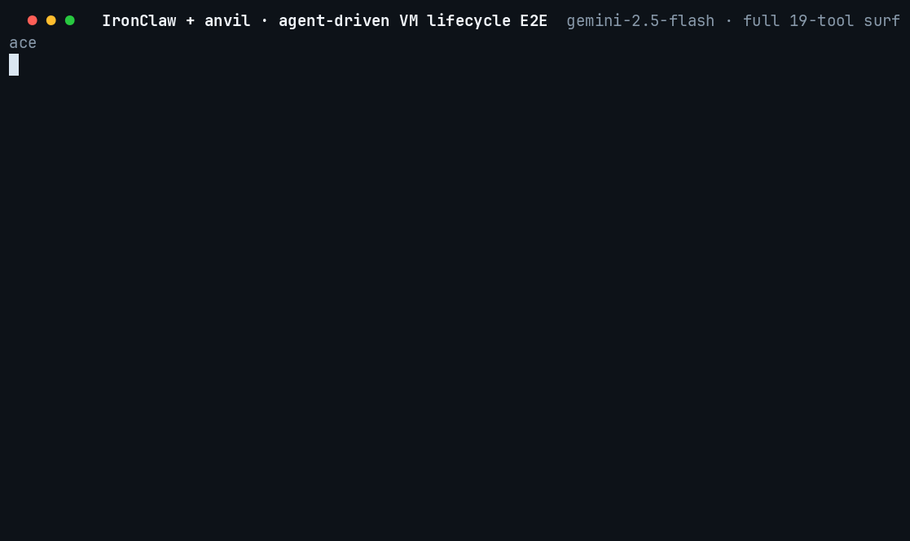

# anvil

[](https://github.com/HardcoreMonk/anvil/actions/workflows/ci.yml)
[](https://github.com/HardcoreMonk/anvil/tags)
[](https://go.dev/)
[](LICENSE)
[](https://github.com/firecracker-microvm/firecracker)

**IronClaw의 tool call을 Firecracker MicroVM 안의 격리 실행으로 변환하는 실행 계층(execution layer).**

VM 생성·작업 실행·health 확인·graceful stop/delete·snapshot/restore lifecycle을 단일 실행
계약으로 통합해, IronClaw가 host runtime 세부를 다루지 않고도 격리 agent를 제어하게 한다.

<p align="center">
  
</p>

<p align="center">
  <sub>IronClaw 본체(gemini-2.5-flash)가 전체 19-tool anvil MCP surface에서 anvil tool을
  스스로 호출해 실제 Firecracker VM lifecycle
  (spawn → task → snapshot → restore → health → delete)을 구동한 E2E replay</sub>
</p>

---

## 빠른 시작

**사전 요구**: Ubuntu 22.04/24.04, `/dev/kvm` 접근, Go 1.25+, `sudo` 권한, 그리고
`curl debootstrap e2fsprogs util-linux jq dmsetup` 패키지. Firecracker·kernel·golden
image는 첫 실행 시 자동으로 준비된다. (Go 없이 릴리즈 tarball로 설치하려면
[`INSTALL.md`](INSTALL.md)를 따른다.)

```bash
# 1. 복제와 빌드
git clone https://github.com/HardcoreMonk/anvil.git && cd anvil
go build -o anvil-daemon ./cmd/goose-daemon/
go build -o anvil-mcp ./cmd/anvil-mcp
go build -o anvil-scheduler ./cmd/anvil-scheduler

# 2. 기본 LLM 설정 (goose-secrets.yaml은 절대 커밋하지 않는다)
cp configs/goose.yaml.example configs/goose.yaml
cp configs/goose-secrets.yaml.example configs/goose-secrets.yaml
#   → configs/goose.yaml에 GOOSE_PROVIDER/GOOSE_MODEL, goose-secrets.yaml에 API key 입력

# 3. 실행 (첫 실행은 golden image·kernel·Firecracker binary를 준비)
sudo ./anvil-daemon
```

사전 요구사항 전체, 빌드 세부, LLM profile·설정 변수, 단위/종단 간 테스트, Operator CLI,
Web UI 사용법은 [`docs/guides/runtime-usage.md`](docs/guides/runtime-usage.md)에 있다.

## 핵심 기능

- **VM·snapshot·flock lifecycle** — `anvil_spawn_vm`/`run_task`/`get_vm_health`/
  `stop_vm`/`delete_vm`, Full/Diff snapshot create/list/restore/delete, 역할별 VM flock
  생성과 Town Wall append-only coordination log.
- **Cross-host routed flock** — scheduler placement로 여러 host daemon에 member VM을
  배치하고, home host hub + daemon-to-daemon relay로 하나의 공유 Town Wall을 쓴다. 임의
  member 간 cross-host `gtcall`(member→home→target 2-hop), home 불능 시 결정적 **재선출
  failover**로 hub SPOF를 해소한다.
- **Snapshot replication 자동화** — adapter reconcile 루프가 desired replica factor
  (**N=2**, 원본+복제 1) 미달 snapshot을 discover→heal한다(best-effort eventual,
  dial-cap giving-up). 수동 경로는 `anvil_replicate_snapshot`.
- **Scheduler service** — `cmd/anvil-scheduler`가 host inventory polling, quota,
  placement, snapshot locality를 control loop로 유지하고 전용 `/metrics`를 노출한다.
- **분리된 두 MCP 표면** — IronClaw용 `cmd/anvil-mcp` adapter(`ANVIL_MCP_*`)와, VM 내부
  agent용 runtime MCP Gateway(`EPHEMERA_MCP_*`, `internal/mcpgateway`)는 별개 개념이다.
  runtime Gateway는 IronClaw adapter를 대체하지 않는다.
- **도메인 정밀 egress 필터** — profile egress policy의 `allow_sni`로 :443 egress를
  도메인 단위로 강제한다. TCP는 파싱된 TLS ClientHello SNI, QUIC/UDP:443은 자체 구현
  QUIC Initial 복호(HKDF+AES-128-GCM+header protection, QUICv1/v2)로 SNI를 추출해
  goose-daemon in-process NFQUEUE verdict 루프가 fail-closed로 판정한다(허용=conntrack
  connmark 커널 fast-path, 비허용=DROP). CIDR allow가 SNI보다 상위 계약이다.
- **운영 표면** — Operator CLI `ephemera-ctl`, 브라우저 Web UI(`/ui/`, EN/KO),
  control-plane 인증(named token·per-token TTL·SIGHUP hot rotation), Prometheus
  `/metrics`, access audit log, end-user installer(`install.sh`/`uninstall.sh`).

기능별 상세와 사용법은 아래 [문서 지도](#문서-지도)의 가이드를 참고한다.

## 프로젝트 경계

`anvil`은 IronClaw의 판단과 tool call을 Firecracker MicroVM 안의 실제 agent 실행으로
변환하는 격리 execution layer다. IronClaw는 상위 orchestration·planner·MCP client를
맡고, anvil은 그 요청을 VM 생성, 작업 실행, health 확인, graceful stop/delete,
snapshot/restore lifecycle로 바꾼다.

구조적으로 anvil은 두 경계를 잇는 MCP adapter이자 실행 계약이다 — IronClaw가 호출하는
`anvil_*` MCP tool surface와, ephemera가 제공하는 KVM 기반 Firecracker MicroVM runtime
boundary. 덕분에 IronClaw는 VM ID·guest URL·daemon/agent token·snapshot lifecycle·
cleanup 같은 host 세부사항을 알 필요 없이 격리 agent workspace를 제어한다.

anvil의 상위 통합 대상은 **IronClaw 전용**이다. OpenClaw 연동은 지원 범위가 아니며,
OpenClaw용 compatibility layer나 운영 계약은 제공하지 않는다.

- **IronClaw**: 상위 orchestration, MCP client, 작업 의사결정을 담당한다.
  현재 구현은 anvil 밖의 외부 통합 계층이다.

- **anvil**: IronClaw가 사용할 MCP tool surface와 실행 lifecycle 계약을 제공한다.
  구현 위치는 `cmd/anvil-mcp`, `internal/anvilmcp`다.

- **anvil runtime scheduler**: 여러 ephemera daemon host 후보 중 요청을 실행할
  host를 고르고 placement/snapshot locality/quota 상태를 보존한다. 구현 위치는
  `cmd/anvil-scheduler`, `internal/anvilmcp`다.

- **ephemera**: Firecracker MicroVM 생성, agent proxy, snapshot/restore,
  host resource 정리를 담당한다. 구현 위치는 `cmd/goose-daemon`, `internal/vm`,
  `internal/storage`, `internal/network`다.

- **guest runtime**: VM 내부 task 실행, health, graceful stop을 담당한다.
  구현 위치는 `cmd/goose-agent`, `cmd/micro-init`이다.

anvil은 ephemera를 이름만 바꾼 프로젝트가 아니다. anvil은 IronClaw와 ephemera를
연결하는 통합 실행 계층이고, ephemera는 독립적인 runtime 구현과 API 계약을
가진다. 따라서 runtime API와 환경 변수는 호환성을 위해 ephemera/goose 이름을
유지하고, IronClaw가 직접 사용하는 표면은 `anvil_*` MCP tool로 노출한다.

## Fork와 upstream 관리

이 저장소(`HardcoreMonk/anvil`, `https://github.com/HardcoreMonk/anvil/`)는
`steve-seungeui/ephemera`(`https://github.com/steve-seungeui/ephemera`)의 fork network를
의도적으로 유지한다. ephemera는 계속 버전업되는 runtime engine upstream이고, anvil은 그
runtime을 IronClaw 실행 계층으로 통합하는 downstream product fork다. anvil은 upstream
runtime 변경을 merge로 받아들이고 그 위에 IronClaw 통합 계층을 적응시킨다. 따라서 Go 모듈
경로·daemon 이름·HTTP API·일부 환경 변수에는 `ephemera`
또는 `goose` 이름이 남아 있다. 문서에서는 `anvil`을 IronClaw 통합 프로젝트로, `ephemera`를
분리된 기반 runtime으로 구분한다.

local `origin`은 `HardcoreMonk/anvil`, `upstream`은 `steve-seungeui/ephemera`를 가리키며,
upstream sync는 `sync/ephemera-*` 브랜치에서 `--no-ff` merge로 수행한다(rebase/history
rewrite 없음). ephemera runtime release tag는 `v*`, anvil product release tag는
`anvil-v*` prefix를 쓰고, 기존 `v*` tag를 덮어쓰는 `git fetch --tags --force`는 사용하지
않는다.

최신 공개 tag는 `anvil-v0.7.0`이다(upstream ephemera 버전과 정렬 — 계보와 tag별 내용은
[`CONTEXT.md`](CONTEXT.md)). 이후 main은 cross-host routed flock(공유 Town Wall·gtcall·
home 재선출 failover), snapshot replication 자동화, egress SNI/L7 필터(TCP+QUIC)와 복구
무결성 하드닝 등 untagged 작업(PR #19 이후)을 더 포함한다. 첫 공개 tag는 `anvil-v0.1.0`이다.

remote 설정과 upstream sync 절차 전체는
[`docs/operations/upstream-sync-policy.md`](docs/operations/upstream-sync-policy.md)에 있다.

## Runtime Baseline

anvil main runtime baseline은 upstream ephemera `v0.7.0`까지를 병합·적응한 상태를
포함한다(수정 없는 ephemera가 아니라, anvil adaptation을 얹은 baseline이다). 태그별
채택/적응/deferred/excluded 분류와 parity 상세는 [`CONTEXT.md`](CONTEXT.md),
[`docs/PUBLIC_RELEASE_BOUNDARY.md`](docs/PUBLIC_RELEASE_BOUNDARY.md),
[`docs/guides/runtime-usage.md`](docs/guides/runtime-usage.md)를 참고한다.

| 구분 | 현재 기준 | anvil에서의 의미 |
|---|---|---|
| ephemera runtime baseline | `v0.7.0` | Firecracker VM lifecycle, cold-restart, flock recovery, token rotation, `/metrics`, `/stats`, `slog`, in-VM `gtcall`, webdev demo, v0.4.0-v0.4.5 runtime 안정화(auth/audit, COW spawn, dynamic flock lifecycle, streaming task, nested depth guard, watchdog status, snapshot-restore auto-recovery), v0.5.0-v0.5.5 operator support(Web UI `/ui/`, `/config/*`, per-VM sizing `1` vCPU/`1024` MiB default), v0.6.0-v0.6.4 runtime MCP Gateway(`EPHEMERA_MCP_*`, anti-spoof/rate-limit/stdio backends), v0.7.0 end-user installer + conversation transcript restore 기반. upstream parity scope(v0.4.0-v0.7.0) 코드 편입 완료 |
| upstream latest observed | `v0.7.0` (2026-07-02 확인) | 관찰 범위 전체 병합·적응 완료, pending sync 후보 없음 |
| anvil product surface | `anvil_*` MCP tool, scheduler, tenant/egress, workload runner | IronClaw가 직접 사용하는 공개 실행 계약 |
| namespace policy | `EPHEMERA_*`, `goose-*`, `ephemera_*` 유지 | upstream runtime 호환성. anvil 이름으로 일괄 rename하지 않는다. |

## 설치

소스에서 빌드하려면 위 빠른 시작 절차를 따른다. Go 툴체인 없이 릴리즈 tarball로 daemon을
systemd 서비스로 설치·업그레이드·제거하려면 [`INSTALL.md`](INSTALL.md)를 따른다.

## 보안

anvil control plane은 named token 인증에 per-token TTL과 SIGHUP hot rotation을 적용하고,
Prometheus `/metrics`와 access audit log로 운영 가시성을 남긴다. guest egress는 profile
`allow_sni`로 :443을 도메인 단위 fail-closed로 강제한다(TCP ClientHello + QUIC Initial 자체
복호, [`docs/adr/0002-egress-sni-transparent-filter.md`](docs/adr/0002-egress-sni-transparent-filter.md)).
보안 모델, 알려진 제약, Resilience·Observability 전체는
[`docs/guides/security-and-resilience.md`](docs/guides/security-and-resilience.md)에 있다.
공개 노출, 제어 평면 token, guest agent token, snapshot metadata 반출 정책은
[`docs/operations/security-policy.md`](docs/operations/security-policy.md)에 있다.

## 아키텍처 개관

요청은 다음 계층을 통과한다.

**IronClaw**(planner·MCP client) → **anvil MCP adapter**(`cmd/anvil-mcp` — `anvil_*`
tool을 stdio로 노출) → *(선택)* **anvil runtime scheduler**(`cmd/anvil-scheduler` —
host inventory·quota·placement·snapshot locality) → **ephemera control plane**(`:3000`
daemon) → **Firecracker MicroVM** 안의 **goose-agent** task runtime.

adapter는 ephemera의 low-level HTTP API를 재해석하지 않고 얇게 호출하며, session alias·
token redaction·restore/cleanup 의미만 변환한다. 계층 다이어그램, ephemera runtime HTTP
API 구조, VM 생성/snapshot/종료 흐름은
[`docs/guides/runtime-usage.md`](docs/guides/runtime-usage.md)에 있다. 각 계층의 세부
구조는 아래 [문서 지도](#문서-지도)의 아키텍처 문서(`docs/architecture/`)를 참고한다.

## 문서 지도

### 사용 가이드 (`docs/guides/`)

- [runtime-usage.md](docs/guides/runtime-usage.md):
  실행 모델, ephemera runtime 분리·기능, 프로젝트 구조, 사전 요구사항·시작하기 전체,
  테스트, 설정, Operator CLI, Web UI, VM별 LLM profile.
- [api-reference.md](docs/guides/api-reference.md):
  ephemera control plane REST API 전체 참조(VM·snapshot·flock·per-VM stats·metrics·
  audit·agent proxy).
- [mcp-adapter.md](docs/guides/mcp-adapter.md):
  IronClaw `anvil_*` MCP tool 표면, multi-tenant foundation/runtime audit, scheduler
  service, routed flock.
- [security-and-resilience.md](docs/guides/security-and-resilience.md):
  보안 모델, 알려진 제약, control plane 인증, Resilience, Observability, Known Limitations.
- [demos.md](docs/guides/demos.md):
  운영자용 멀티에이전트 webdev 데모(`webdev_demo.sh`).
- [INSTALL.md](INSTALL.md):
  릴리즈 tarball로 daemon을 systemd 서비스로 설치·업그레이드·제거.

### 계약·경계

- [CONTEXT.md](CONTEXT.md):
  anvil/ephemera/IronClaw 경계, 진실 기준 문서 순서, 고정 계약, 도메인 용어집.
- [AGENTS.md](AGENTS.md):
  Codex 작업 규약, 검증 명령, 불변 조건.
- [docs/PUBLIC_RELEASE_BOUNDARY.md](docs/PUBLIC_RELEASE_BOUNDARY.md):
  anvil 공개 포함/조건부 포함/제외 표면, upstream ephemera 변경 채택 분류.
- [docs/ADR_INDEX.md](docs/ADR_INDEX.md):
  anvil 장기 설계 결정의 현재 적용 상태와 ADR 작성 기준.
- [RELEASE_NOTES.md](RELEASE_NOTES.md):
  anvil product release note와 upstream ephemera runtime release note를 분리해 기록.

### 아키텍처 (`docs/architecture/`)

- [runtime-architecture.md](docs/architecture/runtime-architecture.md):
  ephemera daemon, MicroVM, storage, network, guest runtime 구조.
- [service-logic.md](docs/architecture/service-logic.md):
  control-plane API, VM lifecycle, snapshot/restore, guest agent 흐름.
- [mcp-architecture.md](docs/architecture/mcp-architecture.md):
  IronClaw MCP adapter 구조와 tool 계약.
- [multi-tenant-roadmap.md](docs/architecture/multi-tenant-roadmap.md):
  tenant quota, scheduler, egress policy, audit storage, multi-host runtime 확장 기준.

### 운영 (`docs/operations/`)

- [security-policy.md](docs/operations/security-policy.md):
  공개 노출, 제어 평면 token, guest agent token, snapshot metadata 반출 정책.
- [runbook.md](docs/operations/runbook.md):
  daemon 빌드/시작, health 확인, VM 정리, snapshot GC 운영 명령.
- [disaster-recovery.md](docs/operations/disaster-recovery.md):
  daemon crash, stale TAP/IP, restore/GC 실패, diff base 누락 대응 playbook.
- [observability.md](docs/operations/observability.md):
  daemon log, `/health`, `/metrics`, `/metrics/vms`, GC/runtime audit, trace export.
- [upstream-sync-policy.md](docs/operations/upstream-sync-policy.md):
  fork 유지, upstream merge, tag 충돌 방지, sync PR 운영 기준(remote 설정 포함).
- [release-checklist.md](docs/operations/release-checklist.md):
  ephemera runtime 릴리즈와 anvil integration 릴리즈를 구분하는 게시 전 확인 절차.

### 분석 (`docs/analysis/`)

- [README.md](docs/analysis/README.md):
  ephemera 0.1.0/0.2.0 분석 문서와 upstream 변경 검토 문서 index.
- [11-v0.5.0-v0.7.0-core-service-parity-review.md](docs/analysis/11-v0.5.0-v0.7.0-core-service-parity-review.md):
  태그별 채택/적응/deferred/excluded parity matrix.

---

## Contributing

See [`CONTRIBUTING.md`](CONTRIBUTING.md) for development setup, test gates, configuration / secrets handling, PR expectations, and the areas of code that need extra care (KVM, networking, snapshots, golden image bake, in-VM auth).

## License

MIT — see [LICENSE](LICENSE).
